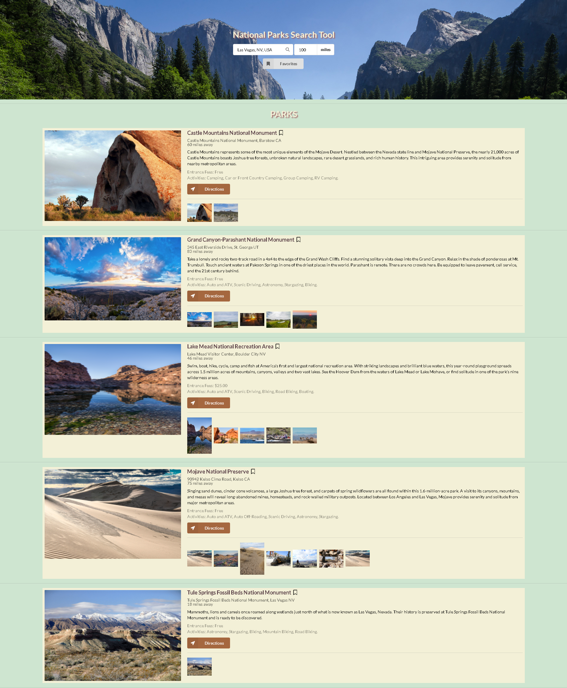

# Endless Trails
National Park Search Tool

User stories,
* AS A lover of travel
* WE WANT a tool to let anyone search for national parks
* SO THAT ANYONE can find their way to adventure near the next travel destination

Live URL link https://tonycodesnow.github.io/NationalParkSearch/

* HTML
* CSS
* Jquery
* JavaScript
* Color Hunt Tools
* Font Awesome
* Semantic UI
* Local-Storage Api
* Lightbox Web Api
* National Parks Api
* Google Prediction Api

The Elevator pitch, Do you really enjoy traveling, seeing sights and the beutiful outdoors. So our goal is to have a website that fellow travelers can use on a day trip (or longer) if your is looking for national parks thats close by or on the way to your next adventure.

The Concept, We understand that not everyone has time to go all the way to the concierge, or talk to the front desk, or do a deep search on google so we wanted to make it easy for people who travel to get the information they needed. With the simple push of a few buttons.

Our future development ideas are, first we would like to turn this into a mobile app. Extend to state and/or local parks. A more enhanced UI experience. We would also like to have a check-in/stickerbadge system for the most adventurous travelers. A lot more optoins to search for specfic activities. And theres much more room for even more improvements.

Created by Sivan, Jose, Jason, Gokul, And Antonio
